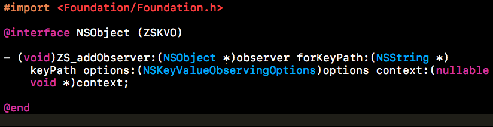
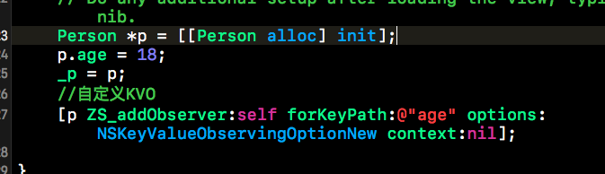
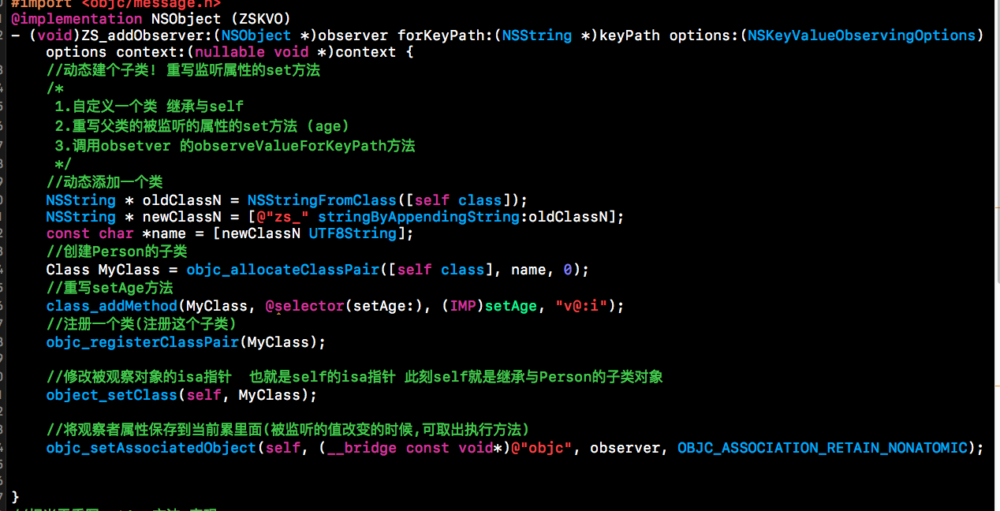
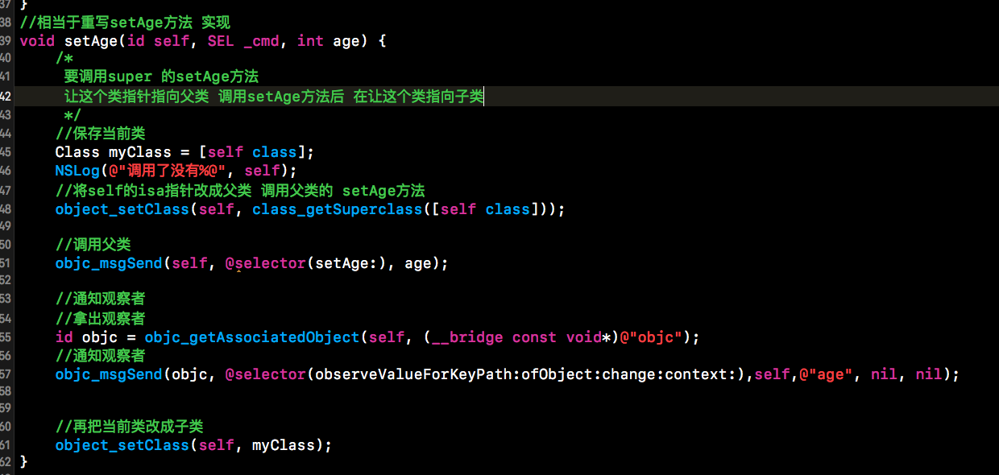

## iOS 自定义kvo
**原理**  系统kvo 主要原理是:创建个被监听对象的子类,然后重新被监听属性的set方法,当这个属性被修改的时候,就让监听者调用某个方法

**代码思路**(简单的自定义KVO)  创建个继承与NSObject 的Person 添加个age属性

创建个NSObject 的分类
并添加个kvo方法

添加监听person的age属性

然后在分类的.m中实现 创建Person的子类 并重写age的set方法 让监听的controller执行 方法
 具体代码
 

